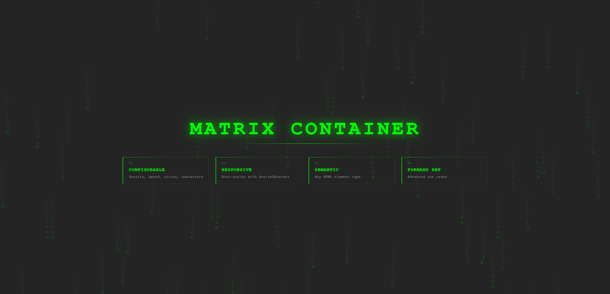

# MatrixContainer

A React component that renders animated katakana matrix-rain behind your content.



## Install & Run

```bash
npm install
npm run dev
# → localhost:5173
```

## Usage

```tsx
import MatrixContainer from '@/shared/components/MatrixContainer';

<MatrixContainer
  as="section"
  canvasOpacity={0.3}
  config={{ columnDensity: 0.4, tickMs: 80, fontSize: 20 }}
>
  <h1>Your content here</h1>
</MatrixContainer>
```

## Props

| Prop | Type | Default | Notes |
|---|---|---|---|
| `children` | ReactNode | — | Content over the animation |
| `config` | Partial<MatrixConfig> | — | Animation overrides (see below) |
| `canvasOpacity` | number | 1 | Canvas opacity (0–1) |
| `as` | ElementType | 'div' | HTML element type |
| `className` | string | — | CSS class for wrapper |
| `style` | CSSProperties | — | Inline styles |
| `id` | string | — | HTML id |
| `ref` | Ref | — | Forwarded to wrapper |

## Config

```typescript
{
  fontSize: 14,           // character size
  columnDensity: 1,       // 0–1, % of active columns
  trailLength: 10,        // glyph count in trail
  tickMs: 60,             // animation speed (ms per frame)
  color: '210,255,120',   // RGB without alpha
  headOpacity: 0.20,      // leading glyph opacity
  trailOpacityMax: 0.10,  // max trail opacity
  chars: [...]            // characters to display (default: katakana)
}
```

## Presets

**Subtle** — sparse, slow, minimal trail
```ts
{ columnDensity: 0.15, tickMs: 250, trailLength: 6, headOpacity: 0.35 }
```

**Default** — full density, fast
```ts
{ columnDensity: 1, tickMs: 60, trailLength: 10, headOpacity: 0.20 }
```

**Dramatic** — classic Matrix look
```ts
{ columnDensity: 0.45, tickMs: 100, trailLength: 16, headOpacity: 0.90 }
```

## How it Works

- Canvas fills the container, glyphs rendered on each tick
- `ResizeObserver` auto-scales on container resize
- Content renders above (z-index layering)
- Characters re-randomize every frame for the flicker effect
- Cleanup: removes listeners on unmount

## Browser Support

Chrome, Edge, Firefox, Safari (recent versions). Requires Canvas 2D + ResizeObserver.

## License

MIT
